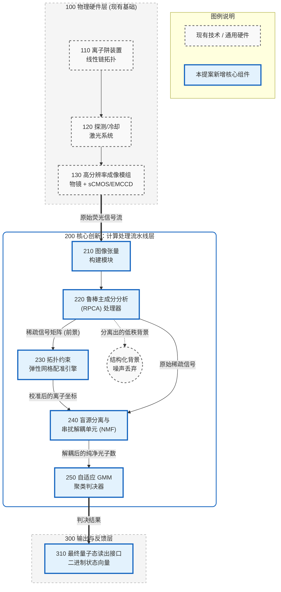

```mermaid
graph TD
    %% ==========================================
    %% 1. 全局样式定义 (Class Definitions)
    %% ==========================================
    
    %% 现有技术样式：灰色背景、虚线边框、细线条
    classDef existing fill:#f9f9f9,stroke:#666,stroke-width:2px,stroke-dasharray: 5 5;
    
    %% 本提案创新样式：淡蓝背景、深蓝实线边框、加粗线条
    classDef novel fill:#e3f2fd,stroke:#1565c0,stroke-width:3px;
    
    %% ==========================================
    %% 2. 图例说明 (Legend)
    %% ==========================================
    subgraph Legend ["图例说明"]
        direction LR
        L1["现有技术 / 通用硬件"]:::existing
        L2["本提案新增核心组件"]:::novel
    end

    %% ==========================================
    %% 3. 第一层：物理硬件层 (现有技术基础)
    %% ==========================================
    subgraph Layer1 ["100 物理硬件层 (现有基础)"]
        direction LR
        %% 定义节点
        A["110 离子阱装置<br>线性链拓扑"]:::existing
        B["120 探测/冷却<br>激光系统"]:::existing
        C["130 高分辨率成像模组<br>物镜 + sCMOS/EMCCD"]:::existing
        
        %% 内部连接
        A --> B
        B --> C
    end

    %% 层级间连接：硬件 -> 软件
    C == "原始荧光信号流" ==> D

    %% ==========================================
    %% 4. 第二层：计算处理流水线层 (核心创新)
    %% ==========================================
    subgraph Layer2 ["200 核心创新：计算处理流水线层"]
        direction TB
        
        %% 模块 D：数据张量化
        D["210 图像张量<br>构建模块"]:::novel
        
        %% 模块 E：RPCA 分离
        E["220 鲁棒主成分分析<br>(RPCA) 处理器"]:::novel
        
        %% 模块 F：网格配准
        F["230 拓扑约束<br>弹性网格配准引擎"]:::novel
        
        %% 模块 G：NMF 解耦
        G["240 盲源分离与<br>串扰解耦单元 (NMF)"]:::novel
        
        %% 模块 H：GMM 判决
        H["250 自适应 GMM<br>聚类判决器"]:::novel
        
        %% 废弃数据节点 (圆形)
        Trash(("结构化背景<br>噪声丢弃")):::existing
        
        %% 内部逻辑连接
        D --> E
        E -- "稀疏信号矩阵 (前景)" --> F
        E -. "分离出的低秩背景" .-> Trash
        
        F -- "校准后的离子坐标" --> G
        E -- "原始稀疏信号" --> G
        
        G -- "解耦后的纯净光子数" --> H
    end

    %% 层级间连接：处理 -> 输出
    H == "判决结果" ==> I

    %% ==========================================
    %% 5. 第三层：输出与反馈层
    %% ==========================================
    subgraph Layer3 ["300 输出与反馈层"]
        I["310 最终量子态读出接口<br>二进制状态向量"]:::novel
    end

    %% ==========================================
    %% 6. 子图背景样式微调 (Sub-graph Styling)
    %% ==========================================
    style Layer1 fill:#f5f5f5,stroke:#999,stroke-width:1px,stroke-dasharray: 5 5
    style Layer2 fill:#ffffff,stroke:#1565c0,stroke-width:2px,rx:10,ry:10
    style Layer3 fill:#f5f5f5,stroke:#999,stroke-width:1px,stroke-dasharray: 5 5
```
